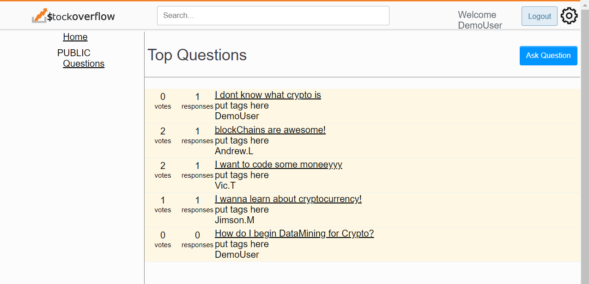
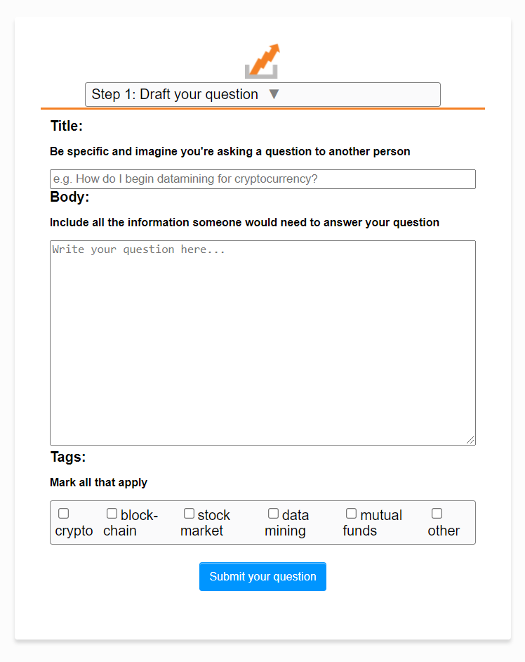

 

  

  <h3 align="center">Stock Overflow</h3>

  

    Stock Overflow is a Stock Market themed  Stack Overflow clone. Users can ask questions, respond to questions and vote for questions that they felt were helpful.
     
    <a href="https://github.com/J0914/StockOverflow"><strong>Explore the docs »</strong></a>
     
     
    <a href="https://stock-overflow-aao.herokuapp.com/">View Demo</a>
    ·
    <a href="https://github.com/J0914/StockOverflow/issues">Report Bug</a>
    ·
    <a href="https://github.com/J0914/StockOverflow/issues">Request Feature</a>
  

<!-- TABLE OF CONTENTS -->

  
Table of Contents

        <li>
        <a href="#about-stock-overflow">About Stock Overflow</a>
        </li>
        <li>
        <a href="#features">Features</a>
        </li>
        <li>
        <a href="#getting-started">Getting Started</a>
        </li>
        <li>
        <a href="#contributors">Contributors</a>
        </li>

 

## About Stock Overflow

</img>

 
 

The stock market influences many people's daily lives and  cryptocurrency is exploding around the world! People have many questions! This site is going to be a one-stop-shop for all of your questions regarding stocks or cryptocurrency specifically and here's why:

* `Your time is valuable,` and having a dedicated resource focused on this topic will make it easier to get your questions answered.

* You shouldn't have to search for hours to find dedicated threads for your stock and crypto questions. Here, you have `everything you need in one place`!

### Built With

    * Javascript
    * Pug
    * Express

 

## <a href="https://github.com/J0914/StockOverflow/wiki/Feature-List"><strong>Features</strong></a>

### Hosting on Heroku

* If you'd like to visit a <a href="https://github.com/J0914/StockOverflow/issues">live version of the site</a>, we are hosted on Heroku!

### New Account Creation, Login, Logout, Demo Login

* Users can create a new account, login, and logout!
* Users can use a demo login to try the site!
* Users can't ask questions or respond to questions unless they are logged in.
* Logged in users can edit their password.
* Logged in users can delete their account.

### Login
 
</img>
 

### Settings
 
</img>
 

### Questions

* Logged in users can ask questions which creates a new thread.
* Logged in users can edit or delete their own Questions.
* All users can view questions regardless of login status.

### Ask a Question
 
</img>
 

### Responses

* Logged in users can post responses to question threads.
* Logged in users can edit or delete their own responses.
* All users can view responses regardless of login status.

### Upvote and Downvote

* Logged in users can upvote or downvote questions.

### Search

* All users can search for questions using the searchbar.

### Tags

* Logged in users can add tags to their questions upon creation.
* All users can click on a tag that is on a question and view a page with all questions that tag is associated with.

 

## Getting Started

     git clone https://github.com/J0914/StockOverflow.git
     npm install
     npm start
     navigate to localhost:8080

## Contributors

### The amazing developers that made this site possible!

 Andrew Loeffler
 

 Jordyn Sechrist
 

 Jimson Ma
 

 Viktorija Tarane

